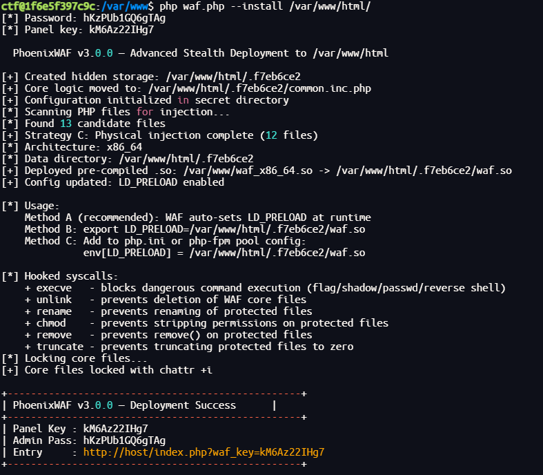
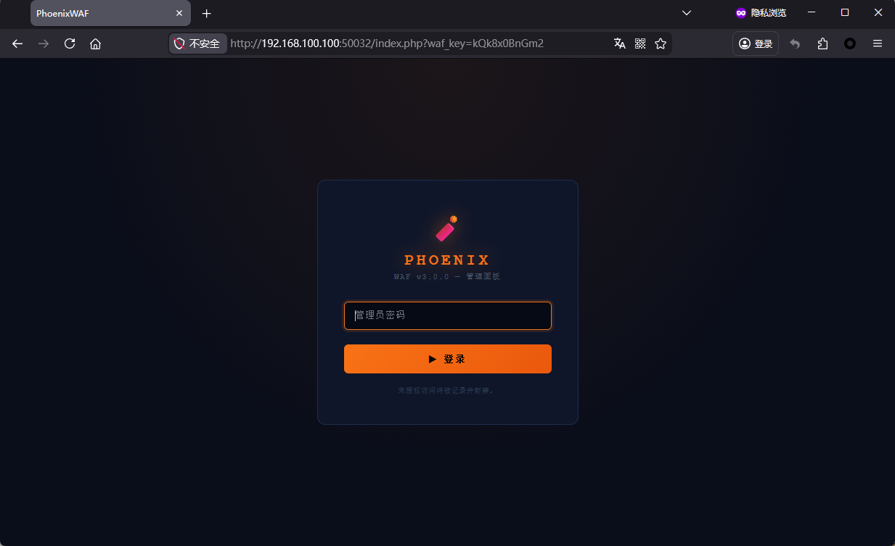
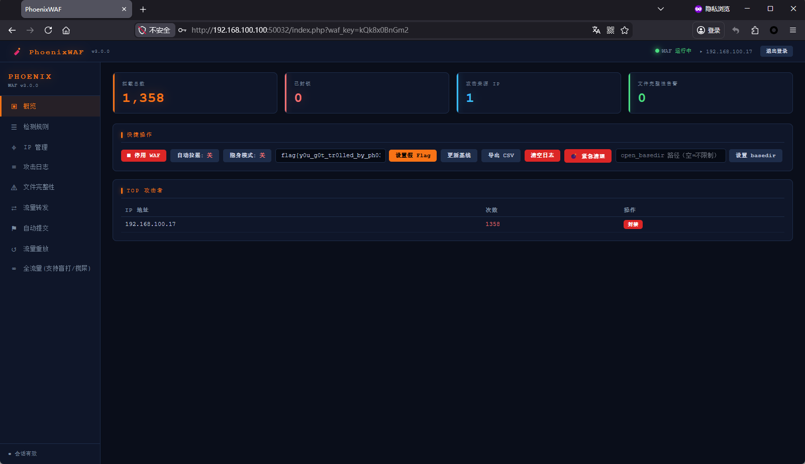
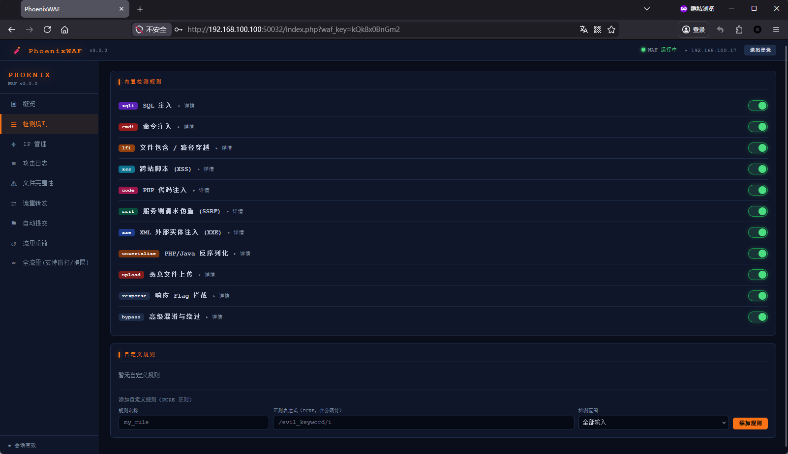
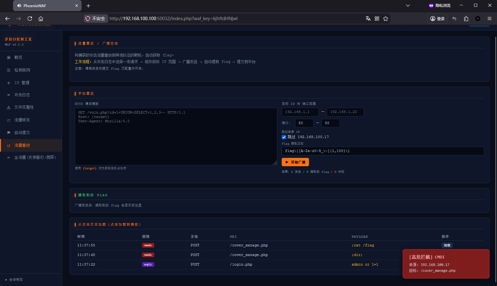
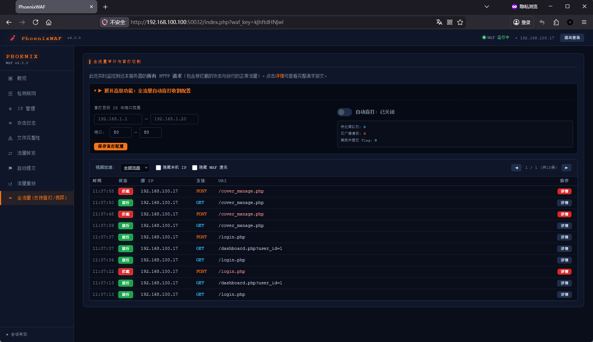
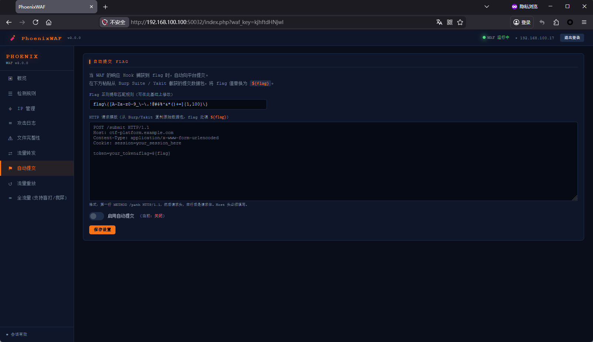
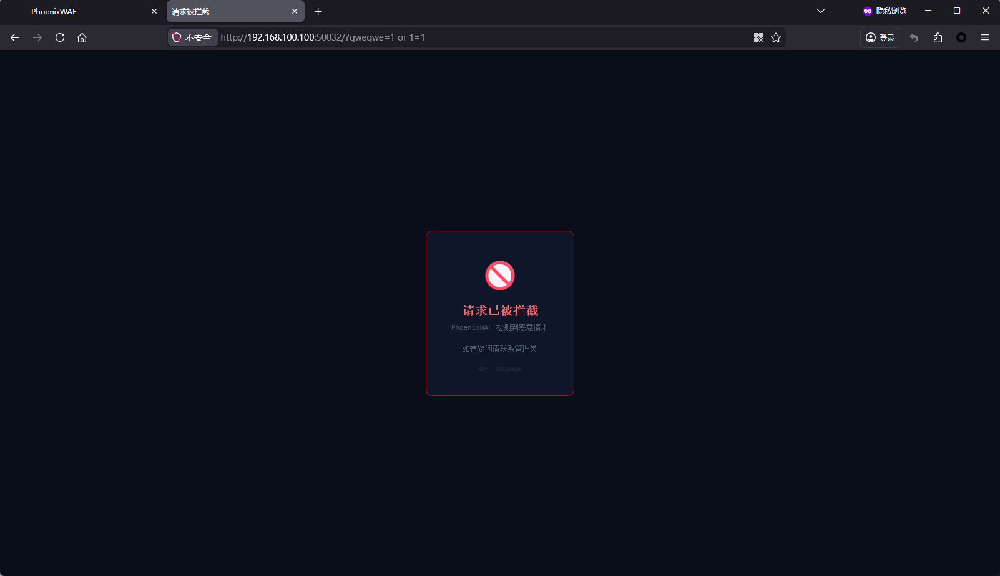

# PhoenixWAF


## 项目简介

PhoenixWAF 是一款专为 AWD (Attack With Defense) CTF 竞赛设计的、极具防御纵深的高阶 PHP Web 应用防火墙。通过流量解码、内核监控、底层系统调用劫持等多维度防御手段，系统不仅能有效拦截常见 Web 攻击并保护 Flag，还将赛场反击自动化，提供了一键流量广播重放、盲打收割与 Flag 自动提交功能，帮助防守方在零宕机的前提下实现绝地反击。

> **💡 大道至简版 (Minified Version)：**
> 作者已使用 `php -w` 命令去除了源码中的所有注释和换行符，生成了小体积的高混淆 PHP 文件，该版本已放置在项目的 **Releases** 中。

## 适配场景与环境

本项目经过专门设计和测试，主要适配于各大 AWD 赛事的标准 PHP 运行环境（如 Apache/Nginx + PHP-FPM）。
* **兼容性：** 支持 PHP 5.x 及以上版本（底层防御依赖 Linux 系统）。
* **免杀隐蔽：** 运行时自动隐藏核心逻辑，不改变目标应用原有目录结构。

## 功能特性

* **十层立体防御架构：**
    * **L1 - L3:** 防绕过多层解码管道、响应劫持（Base64/Hex 编码 Flag 嗅探与替换）、文件上传深度探测与成功响应伪造。
    * **L4 - L5:** IP 频率限制与自动封禁、蜜罐路径诱导与假 Flag 投毒。
    * **L6 - L7:** 基于 `inotifywait` 的内核级文件监控（秒杀不死马）、SHA256 文件完整性基线比对。
    * **L8 - L10:** 启发式裁判机自动加白（防误封宕机）、WAF 核心文件被删自动恢复、全局异常静默放行（绝不影响正常业务）。
* **底层系统级保护 (LD_PRELOAD):** 动态编译下发 `.so` 文件，在 OS 层面 Hook `execve`, `unlink`, `rename`, `chmod` 等系统调用，直接阻断反弹 Shell 等底层命令执行，并死锁 WAF 核心文件。
* **变色龙隐身机制 (Stealth Mode):** 拦截恶意请求后拒绝返回 403，而是根据目标站点的特征（如 JSON API、ThinkPHP、极简空页面等）伪造 200 OK 响应，并加入模拟业务耗时的正态分布随机延迟，彻底消除 WAF 指纹。
* **全自动化进攻与收割：**
    * **流量重放 (Replay):** 从拦截日志中一键提取敌方 Payload，向其他队伍靶机广播攻击。
    * **盲打收割 (AutoReap):** 开启全流量实时监听，自动提取有效请求包并向全网段异步盲打，成功利用后自动截取 Flag。
    * **自动提交 (FlagSub):** 截获或盲打获取 Flag 后，自动依据配置的 HTTP 模板向平台提交得分。

## 目录结构

系统在执行全新安装时采用极高隐蔽性部署，摒弃了传统的暴露式结构，在 Web 目录下只会生成以下真实防御拓扑（不再生成 `.pwaf_ptr` 指针，全靠绝对路径硬编码寻址）：

```text
/var/www/html/
├── .[随机8位小写/数字]/         # 高度隐蔽的 WAF 数据与核心工作目录
│   ├── common.inc.php        # WAF 核心逻辑（部署时由 waf.php 复制并重命名）
│   ├── .pwaf.php             # 系统动态配置文件
│   ├── waf.so                # 动态编译生成的 LD_PRELOAD 保护库
│   ├── .pwaf_watcher.sh      # inotifywait 内核级不死马查杀守护进程
│   └── .pwaf_log             # 攻击拦截日志与全流量抓取存储
├── .user.ini                 # 自动挂载入口 (策略 A，内含指向 common.inc.php 的硬编码绝对路径)
└── .htaccess                 # 自动挂载入口及静态资源保护 (策略 B，内含强制解析配置及硬编码绝对路径)
```

## 安装与运行

### 1. 快速部署 (CLI)

将 WAF 脚本（推荐使用 Releases 中的大道至简版）建议上传至靶机web上一级目录，通过 SSH 执行自动化安装：

```bash
# 基本安装
php waf.php --install /var/www/html [--password 你的管理密码] [--key 你的面板入口校验值]
```

安装脚本会自动创建隐蔽目录、向所有存在的 PHP 文件物理注入加载代码、配置 `.user.ini` / `.htaccess`，并尝试编译底层 Hook 库。


### 2. 强化部署命令 (可选)

```bash
# 单独部署或修复 inotifywait 内核级文件监控（查杀不死马）
php waf.php --immortal /var/www/html

# 单独编译并部署 LD_PRELOAD 底层进程/文件锁保护
php waf.php --ldpreload /var/www/html
```

## 使用说明

1. **访问管理面板:** 安装成功后，通过浏览器访问目标站点的任意有效 PHP 页面，并附加鉴权参数。例如 `http://192.168.1.100/index.php?waf_key=[你的KEY]`。



2. **核心防御监控:** 登录后进入“概览”面板，您可以实时查看拦截总量、文件完整性异常，并可一键开启/关闭 WAF、隐身模式或执行紧急清理（一键杀毒/清理 `/tmp` 目录）。



3. **管理规则与自定义防御:** 点击“检测规则”选项卡，支持开关不同类型的防御引擎，或通过编写 PCRE 正则表达式直接下发自定义拦截规则，精准对抗 0day 攻击。



4. **流量重放与广播 (Replay):** 当 WAF 拦截到敌方的高质量 Payload 时，进入“流量重放”页面，可以直接将该请求加载到模板中，配置目标 IP 范围后一键广播打全场。



5. **全流量+盲打搅屎 (AutoReap):** 这是本系统的核心反击武器。在“全流量”页面开启自动盲打后，系统会将进入靶机的所有非异常请求（正常流量或潜在 EXP）全部推入异步队列，向全网所有靶机盲打重发。



6. **自动提交配置 (FlagSub):** 在该页面配置比赛平台的 HTTP 提交报文（需包含 Cookie 等认证信息，Flag 值用 `${flag}` 代替），一旦防守截获或攻击收割到 Flag，将立即自动上分。



7. **拦截界面:** 检测到攻击会自动触发响应如下拦截界面：



```
    if (!empty($cfg['stealth'])) {
        pwaf_random_delay();
        pwaf_chameleon_response($cfg, $rule);
    } else {
        http_response_code(403);
        $rid = strtoupper(substr(md5($ip . microtime(true) . random_int(0,999999)), 0, 8));
        echo '<!DOCTYPE html><html lang="zh"><head><meta charset="UTF-8"><title>请求被拦截</title>'
           . '<style>*{margin:0;padding:0;box-sizing:border-box}body{background:#0a0e1a;color:#c9d1e0;'
           . 'font-family:Consolas,monospace;display:flex;align-items:center;justify-content:center;min-height:100vh}'
           . '.box{background:#0f1629;border:1px solid #991b1b;border-radius:10px;padding:36px 40px;max-width:480px;text-align:center}'
           . '.icon{font-size:48px;margin-bottom:16px}.title{color:#f87171;font-size:20px;font-weight:bold;margin-bottom:8px}'
           . '.sub{color:#4a5568;font-size:12px;margin-bottom:20px}.rule{display:inline-block;background:#991b1b;'
           . 'color:#fff;padding:3px 10px;border-radius:4px;font-size:12px;font-weight:bold;margin-bottom:16px}'
           . '.rid{color:#1e2d4a;font-size:10px;margin-top:16px}</style></head>'
           . '<body><div class="box"><div class="icon">&#x1F6AB;</div>'
           . '<div class="title">请求已被拦截</div>'
           . '<div class="sub">PhoenixWAF 检测到恶意请求</div>'
           // . '<div class="rule">' . htmlspecialchars($rule) . '</div>'            <---如果想在拦截界面显示拦截规则，取消这里的注释即可
           . '<div class="sub">如有疑问请联系管理员</div>'
           . '<div class="rid">REF: ' . $rid . '</div>'
           . '</div></body></html>';
    }
    exit;
```


